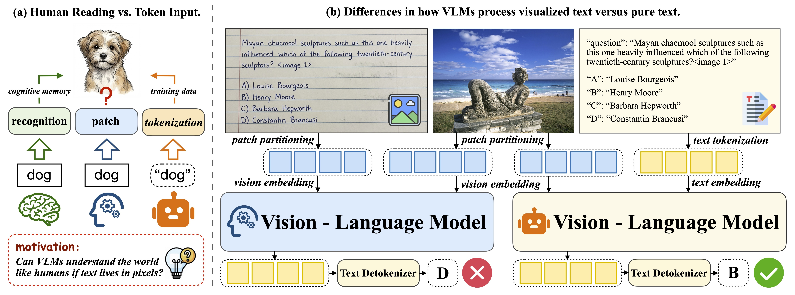
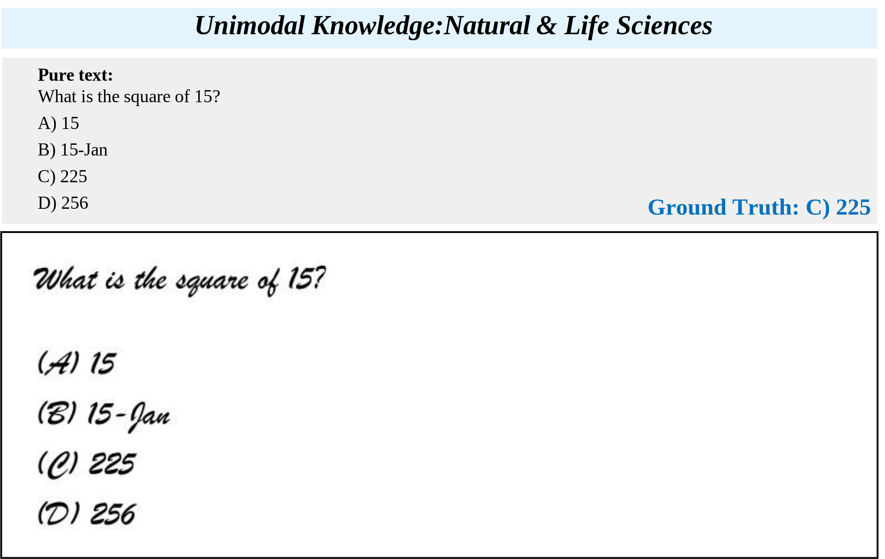
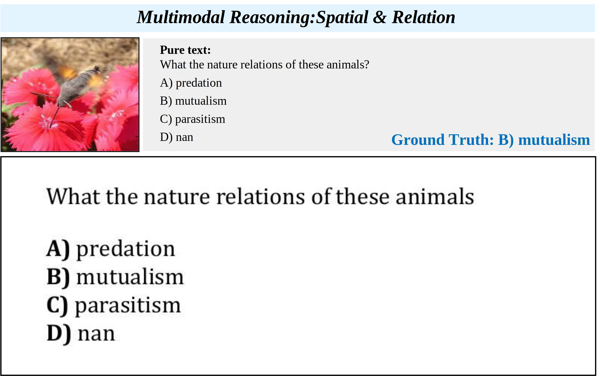

# VISTA-Bench

<p align="center">
  
</p>
<p align="center">
  <strong>Do VLMs really understand visualized text as well as pure text?</strong><br/>
  A systematic benchmark spanning <em>multimodal perception → reasoning → unimodal knowledge</em>.
</p>

<p align="center">
  
  
  
  
</p>

<p align="center">
  <em>Figure 1: Motivation of VISTA-Bench.</em>
</p>

---

## Overview

We introduce **VISTA-Bench**, a systematic benchmark spanning multimodal perception, reasoning, and unimodal understanding. It evaluates *visualized text understanding* by contrasting **pure-text** and **visualized-text (VT)** questions under controlled rendering conditions.

---

## Dataset at a glance

- **Size:** 1,500 instances
- **Composition:** predominantly multiple-choice questions (MCQ), with a small portion of open-ended queries
- **Task taxonomy (4 primary categories):**
  - **Unimodal Knowledge:** 500
  - **Multimodal Knowledge:** 400
  - **Multimodal Perception:** 300
  - **Multimodal Reasoning:** 300

<p align="center">
  
</p>
<p align="center">
  <em>Figure 2: Ability dimensions and task taxonomy of VISTA-Bench.</em>
</p>

---

## Qualitative example

<p align="center">
  
</p>

<p align="center">
  
</p>

<p align="center">
  <em>Figure 3: A representative multimodal perception case under the visualized-text interface.</em>
</p>

---

## Repository structure

```text
VISTA-Bench/
├─ assets/figures/    # figures used in this README
├─ images/            # original images (for multimodal instances)
├─ questions/         # rendered question/option images (VT setting)
├─ VLMEvalKit/        # evaluation toolkit
├─ VISTA-Bench.tsv    # dataset index (currently identical to the VT variant)
└─ VISTA-Bench-VT.tsv # dataset index (currently identical; kept for compatibility)
```

> **Note:** `VISTA-Bench.tsv` and `VISTA-Bench-VT.tsv` are currently identical; we keep both filenames for compatibility and will refine the organization later.

---

## Data format

- `images/`: original images used by multimodal instances
- `questions/`: rendered question/option images for the visualized-text (VT) setting
- `*.tsv`: dataset metadata and file paths used for evaluation

---

## Evaluation (VLMEvalKit)

We evaluate VISTA-Bench with `VLMEvalKit/`.  
Before running evaluation, we recommend converting the TSV file(s) into a normalized format with absolute image paths.

### 1) Convert TSV to normalized paths

Helper script:
- `VISTA-Bench/VLMEvalKit/utils/convert_data_file.py`

What it does:
- converts the TSV encoding to UTF-8
- normalizes path separators (`\` → `/`)
- renames `options_A/B/C/D` → `A/B/C/D` when needed
- converts `image_path` and `question_image_path` into a bracket-style multi-path string

Example:

```bash
python VISTA-Bench/VLMEvalKit/utils/convert_data_file.py   --in   VISTA-Bench/VISTA-Bench.tsv   --out  VISTA-Bench/VISTA-Bench_norm.tsv   --image-prefix /ABS/PATH/TO/VISTA-Bench   --strip-token ""
```

### 2) Run evaluation

**Pure-text:**
```bash
python run.py \
  --data VISTA-Bench \
  --model llava_v1.5_7b \
  --verbose
```

**Visualized-text (VT):**
```bash
python run.py \
  --data VISTA-Bench-VT \
  --model llava_v1.5_7b \
  --verbose
```

---

## Results

<div align="center">
<table style="width:100%; border-collapse:collapse; font-size:14px; line-height:1.25;">
  <thead>
    <tr>
      <th colspan="12" style="border:1px solid #cfd7e3; padding:12px 10px; text-align:center; font-size:20px; font-weight:700;">
        Modality Comparison (VT vs. Text)
      </th>
    </tr>
    <tr>
      <th rowspan="3" style="border:1px solid #cfd7e3; padding:10px; text-align:left; width:28%;">Model</th>
      <th colspan="2" style="border:1px solid #cfd7e3; padding:10px; text-align:center;">Multimodal</th>
      <th colspan="2" style="border:1px solid #cfd7e3; padding:10px; text-align:center;">Multimodal</th>
      <th colspan="2" style="border:1px solid #cfd7e3; padding:10px; text-align:center;">Multimodal</th>
      <th colspan="2" style="border:1px solid #cfd7e3; padding:10px; text-align:center;">Unimodal</th>
      <th colspan="2" rowspan="2" style="border:1px solid #cfd7e3; padding:10px; text-align:center;">Overall</th>
      <th rowspan="3" style="border:1px solid #cfd7e3; padding:10px; text-align:center; width:10%;">↓ Gap</th>
    </tr>
    <tr>
      <th colspan="2" style="border:1px solid #cfd7e3; padding:10px; text-align:center;">Perception</th>
      <th colspan="2" style="border:1px solid #cfd7e3; padding:10px; text-align:center;">Reasoning</th>
      <th colspan="2" style="border:1px solid #cfd7e3; padding:10px; text-align:center;">Knowledge</th>
      <th colspan="2" style="border:1px solid #cfd7e3; padding:10px; text-align:center;">Knowledge</th>
    </tr>
    <tr>
      <th style="border:1px solid #cfd7e3; padding:10px; text-align:center;">VT</th>
      <th style="border:1px solid #cfd7e3; padding:10px; text-align:center; background:#e8e8e8;">Text</th>
      <th style="border:1px solid #cfd7e3; padding:10px; text-align:center;">VT</th>
      <th style="border:1px solid #cfd7e3; padding:10px; text-align:center; background:#e8e8e8;">Text</th>
      <th style="border:1px solid #cfd7e3; padding:10px; text-align:center;">VT</th>
      <th style="border:1px solid #cfd7e3; padding:10px; text-align:center; background:#e8e8e8;">Text</th>
      <th style="border:1px solid #cfd7e3; padding:10px; text-align:center;">VT</th>
      <th style="border:1px solid #cfd7e3; padding:10px; text-align:center; background:#e8e8e8;">Text</th>
      <th style="border:1px solid #cfd7e3; padding:10px; text-align:center;">VT</th>
      <th style="border:1px solid #cfd7e3; padding:10px; text-align:center; background:#e8e8e8;">Text</th>
    </tr>
  </thead>
  <tbody>
    <!-- ===== Group: 2B ===== -->
    <tr>
      <td colspan="12" style="border:1px solid #cfd7e3; padding:10px; background:#ebf5ff; font-weight:700;">
        ▼ Vision-Language Models (2B)
      </td>
    </tr>
    <tr style="background:#ffffff;">
      <td style="border:1px solid #cfd7e3; padding:10px; text-align:left;">DeepSeek-VL2-Tiny</td>
      <td style="border:1px solid #cfd7e3; padding:10px; text-align:center;">44.3</td>
      <td style="border:1px solid #cfd7e3; padding:10px; text-align:center; background:#e8e8e8;">64.0</td>
      <td style="border:1px solid #cfd7e3; padding:10px; text-align:center;">31.3</td>
      <td style="border:1px solid #cfd7e3; padding:10px; text-align:center; background:#e8e8e8;">43.7</td>
      <td style="border:1px solid #cfd7e3; padding:10px; text-align:center;">27.5</td>
      <td style="border:1px solid #cfd7e3; padding:10px; text-align:center; background:#e8e8e8;">28.8</td>
      <td style="border:1px solid #cfd7e3; padding:10px; text-align:center;">27.6</td>
      <td style="border:1px solid #cfd7e3; padding:10px; text-align:center; background:#e8e8e8;">41.8</td>
      <td style="border:1px solid #cfd7e3; padding:10px; text-align:center;">31.7</td>
      <td style="border:1px solid #cfd7e3; padding:10px; text-align:center; background:#e8e8e8;">43.1</td>
      <td style="border:1px solid #cfd7e3; padding:10px; text-align:center; background:#e9c3c3; color:#c80000; font-weight:600;">↓ -11.4</td>
    </tr>
    <tr style="background:#f7f9fb;">
      <td style="border:1px solid #cfd7e3; padding:10px; text-align:left;">Qwen3-VL-2B-Instruct</td>
      <td style="border:1px solid #cfd7e3; padding:10px; text-align:center;">51.3</td>
      <td style="border:1px solid #cfd7e3; padding:10px; text-align:center; background:#e8e8e8;"><u>69.0</u></td>
      <td style="border:1px solid #cfd7e3; padding:10px; text-align:center;">32.7</td>
      <td style="border:1px solid #cfd7e3; padding:10px; text-align:center; background:#e8e8e8;">49.7</td>
      <td style="border:1px solid #cfd7e3; padding:10px; text-align:center;">17.5</td>
      <td style="border:1px solid #cfd7e3; padding:10px; text-align:center; background:#e8e8e8;">24.0</td>
      <td style="border:1px solid #cfd7e3; padding:10px; text-align:center;">37.2</td>
      <td style="border:1px solid #cfd7e3; padding:10px; text-align:center; background:#e8e8e8;">52.0</td>
      <td style="border:1px solid #cfd7e3; padding:10px; text-align:center;">33.9</td>
      <td style="border:1px solid #cfd7e3; padding:10px; text-align:center; background:#e8e8e8;">47.5</td>
      <td style="border:1px solid #cfd7e3; padding:10px; text-align:center; background:#e6b6b6; color:#c80000; font-weight:600;">↓ -13.6</td>
    </tr>
    <tr style="background:#ffffff;">
      <td style="border:1px solid #cfd7e3; padding:10px; text-align:left;">Ovis2-2B</td>
      <td style="border:1px solid #cfd7e3; padding:10px; text-align:center;">58.3</td>
      <td style="border:1px solid #cfd7e3; padding:10px; text-align:center; background:#e8e8e8;">66.7</td>
      <td style="border:1px solid #cfd7e3; padding:10px; text-align:center;">39.7</td>
      <td style="border:1px solid #cfd7e3; padding:10px; text-align:center; background:#e8e8e8;">52.3</td>
      <td style="border:1px solid #cfd7e3; padding:10px; text-align:center;">27.0</td>
      <td style="border:1px solid #cfd7e3; padding:10px; text-align:center; background:#e8e8e8;">31.2</td>
      <td style="border:1px solid #cfd7e3; padding:10px; text-align:center;">36.0</td>
      <td style="border:1px solid #cfd7e3; padding:10px; text-align:center; background:#e8e8e8;">50.2</td>
      <td style="border:1px solid #cfd7e3; padding:10px; text-align:center;">38.8</td>
      <td style="border:1px solid #cfd7e3; padding:10px; text-align:center; background:#e8e8e8;">48.9</td>
      <td style="border:1px solid #cfd7e3; padding:10px; text-align:center; background:#eac8c8; color:#c80000; font-weight:600;">↓ -10.1</td>
    </tr>
    <tr style="background:#f7f9fb;">
      <td style="border:1px solid #cfd7e3; padding:10px; text-align:left;">NEO-2B-SFT</td>
      <td style="border:1px solid #cfd7e3; padding:10px; text-align:center;">40.0</td>
      <td style="border:1px solid #cfd7e3; padding:10px; text-align:center; background:#e8e8e8;">68.3</td>
      <td style="border:1px solid #cfd7e3; padding:10px; text-align:center;">31.3</td>
      <td style="border:1px solid #cfd7e3; padding:10px; text-align:center; background:#e8e8e8;">49.3</td>
      <td style="border:1px solid #cfd7e3; padding:10px; text-align:center;">25.3</td>
      <td style="border:1px solid #cfd7e3; padding:10px; text-align:center; background:#e8e8e8;">37.3</td>
      <td style="border:1px solid #cfd7e3; padding:10px; text-align:center;">29.4</td>
      <td style="border:1px solid #cfd7e3; padding:10px; text-align:center; background:#e8e8e8;">53.4</td>
      <td style="border:1px solid #cfd7e3; padding:10px; text-align:center;">30.8</td>
      <td style="border:1px solid #cfd7e3; padding:10px; text-align:center; background:#e8e8e8;">51.3</td>
      <td style="border:1px solid #cfd7e3; padding:10px; text-align:center; background:#d89a9a; color:#c80000; font-weight:600;">↓ -20.5</td>
    </tr>
    <tr style="background:#ffffff; color:#5a5a5a;">
      <td style="border:1px solid #cfd7e3; padding:10px; text-align:left;">Qwen2.5-VL-3B-Instruct</td>
      <td style="border:1px solid #cfd7e3; padding:10px; text-align:center;">65.0</td>
      <td style="border:1px solid #cfd7e3; padding:10px; text-align:center; background:#e8e8e8;">67.7</td>
      <td style="border:1px solid #cfd7e3; padding:10px; text-align:center;">43.3</td>
      <td style="border:1px solid #cfd7e3; padding:10px; text-align:center; background:#e8e8e8;">54.3</td>
      <td style="border:1px solid #cfd7e3; padding:10px; text-align:center;"><strong>32.5</strong></td>
      <td style="border:1px solid #cfd7e3; padding:10px; text-align:center; background:#e8e8e8;">35.8</td>
      <td style="border:1px solid #cfd7e3; padding:10px; text-align:center;"><strong>54.8</strong></td>
      <td style="border:1px solid #cfd7e3; padding:10px; text-align:center; background:#e8e8e8;">56.6</td>
      <td style="border:1px solid #cfd7e3; padding:10px; text-align:center;"><strong>48.6</strong></td>
      <td style="border:1px solid #cfd7e3; padding:10px; text-align:center; background:#e8e8e8;">52.8</td>
      <td style="border:1px solid #cfd7e3; padding:10px; text-align:center; background:#f0e0e0; color:#c80000; font-weight:600;">↓ -4.2</td>
    </tr>
    <tr style="background:#f7f9fb;">
      <td style="border:1px solid #cfd7e3; padding:10px; text-align:left;">InternVL3.5-2B</td>
      <td style="border:1px solid #cfd7e3; padding:10px; text-align:center;">56.0</td>
      <td style="border:1px solid #cfd7e3; padding:10px; text-align:center; background:#e8e8e8;">66.3</td>
      <td style="border:1px solid #cfd7e3; padding:10px; text-align:center;">39.3</td>
      <td style="border:1px solid #cfd7e3; padding:10px; text-align:center; background:#e8e8e8;">50.3</td>
      <td style="border:1px solid #cfd7e3; padding:10px; text-align:center;">30.5</td>
      <td style="border:1px solid #cfd7e3; padding:10px; text-align:center; background:#e8e8e8;"><strong>39.8</strong></td>
      <td style="border:1px solid #cfd7e3; padding:10px; text-align:center;">44.8</td>
      <td style="border:1px solid #cfd7e3; padding:10px; text-align:center; background:#e8e8e8;"><u>57.0</u></td>
      <td style="border:1px solid #cfd7e3; padding:10px; text-align:center;">42.1</td>
      <td style="border:1px solid #cfd7e3; padding:10px; text-align:center; background:#e8e8e8;">52.9</td>
      <td style="border:1px solid #cfd7e3; padding:10px; text-align:center; background:#e9c3c3; color:#c80000; font-weight:600;">↓ -10.8</td>
    </tr>
    <tr style="background:#ffffff;">
      <td style="border:1px solid #cfd7e3; padding:10px; text-align:left;">SAIL-VL2-2B</td>
      <td style="border:1px solid #cfd7e3; padding:10px; text-align:center;"><u>65.3</u></td>
      <td style="border:1px solid #cfd7e3; padding:10px; text-align:center; background:#e8e8e8;"><strong>69.7</strong></td>
      <td style="border:1px solid #cfd7e3; padding:10px; text-align:center;"><u>47.3</u></td>
      <td style="border:1px solid #cfd7e3; padding:10px; text-align:center; background:#e8e8e8;"><u>57.7</u></td>
      <td style="border:1px solid #cfd7e3; padding:10px; text-align:center;"><u>32.2</u></td>
      <td style="border:1px solid #cfd7e3; padding:10px; text-align:center; background:#e8e8e8;">39.0</td>
      <td style="border:1px solid #cfd7e3; padding:10px; text-align:center;">43.6</td>
      <td style="border:1px solid #cfd7e3; padding:10px; text-align:center; background:#e8e8e8;">54.8</td>
      <td style="border:1px solid #cfd7e3; padding:10px; text-align:center;">45.7</td>
      <td style="border:1px solid #cfd7e3; padding:10px; text-align:center; background:#e8e8e8;"><u>54.1</u></td>
      <td style="border:1px solid #cfd7e3; padding:10px; text-align:center; background:#edd0d0; color:#c80000; font-weight:600;">↓ -8.4</td>
    </tr>
    <tr style="background:#f7f9fb;">
      <td style="border:1px solid #cfd7e3; padding:10px; text-align:left;">Ovis2.5-2B</td>
      <td style="border:1px solid #cfd7e3; padding:10px; text-align:center;"><strong>66.3</strong></td>
      <td style="border:1px solid #cfd7e3; padding:10px; text-align:center; background:#e8e8e8;"><strong>69.7</strong></td>
      <td style="border:1px solid #cfd7e3; padding:10px; text-align:center;"><strong>51.7</strong></td>
      <td style="border:1px solid #cfd7e3; padding:10px; text-align:center; background:#e8e8e8;"><strong>58.0</strong></td>
      <td style="border:1px solid #cfd7e3; padding:10px; text-align:center;">28.5</td>
      <td style="border:1px solid #cfd7e3; padding:10px; text-align:center; background:#e8e8e8;"><u>39.5</u></td>
      <td style="border:1px solid #cfd7e3; padding:10px; text-align:center;"><u>51.8</u></td>
      <td style="border:1px solid #cfd7e3; padding:10px; text-align:center; background:#e8e8e8;"><strong>60.0</strong></td>
      <td style="border:1px solid #cfd7e3; padding:10px; text-align:center;"><u>48.5</u></td>
      <td style="border:1px solid #cfd7e3; padding:10px; text-align:center; background:#e8e8e8;"><strong>56.1</strong></td>
      <td style="border:1px solid #cfd7e3; padding:10px; text-align:center; background:#eed3d3; color:#c80000; font-weight:600;">↓ -7.6</td>
    </tr>
    <!-- ===== Group: 8B ===== -->
    <tr>
      <td colspan="12" style="border:1px solid #cfd7e3; padding:10px; background:#ebf5ff; font-weight:700;">
        ▼ Vision-Language Models (8B)
      </td>
    </tr>
    <tr style="background:#ffffff;">
      <td style="border:1px solid #cfd7e3; padding:10px; text-align:left;">LLaVA-1.5-7B</td>
      <td style="border:1px solid #cfd7e3; padding:10px; text-align:center;">33.0</td>
      <td style="border:1px solid #cfd7e3; padding:10px; text-align:center; background:#e8e8e8;">58.7</td>
      <td style="border:1px solid #cfd7e3; padding:10px; text-align:center;">27.3</td>
      <td style="border:1px solid #cfd7e3; padding:10px; text-align:center; background:#e8e8e8;">44.3</td>
      <td style="border:1px solid #cfd7e3; padding:10px; text-align:center;">26.5</td>
      <td style="border:1px solid #cfd7e3; padding:10px; text-align:center; background:#e8e8e8;">27.3</td>
      <td style="border:1px solid #cfd7e3; padding:10px; text-align:center;">24.0</td>
      <td style="border:1px solid #cfd7e3; padding:10px; text-align:center; background:#e8e8e8;">48.8</td>
      <td style="border:1px solid #cfd7e3; padding:10px; text-align:center;">27.1</td>
      <td style="border:1px solid #cfd7e3; padding:10px; text-align:center; background:#e8e8e8;">44.1</td>
      <td style="border:1px solid #cfd7e3; padding:10px; text-align:center; background:#e0aaaa; color:#c80000; font-weight:600;">↓ -17.0</td>
    </tr>
    <tr style="background:#f7f9fb;">
      <td style="border:1px solid #cfd7e3; padding:10px; text-align:left;">LLaVA-OneVision-7B</td>
      <td style="border:1px solid #cfd7e3; padding:10px; text-align:center;">40.3</td>
      <td style="border:1px solid #cfd7e3; padding:10px; text-align:center; background:#e8e8e8;">66.0</td>
      <td style="border:1px solid #cfd7e3; padding:10px; text-align:center;">27.0</td>
      <td style="border:1px solid #cfd7e3; padding:10px; text-align:center; background:#e8e8e8;">56.3</td>
      <td style="border:1px solid #cfd7e3; padding:10px; text-align:center;">20.0</td>
      <td style="border:1px solid #cfd7e3; padding:10px; text-align:center; background:#e8e8e8;">35.3</td>
      <td style="border:1px solid #cfd7e3; padding:10px; text-align:center;">27.0</td>
      <td style="border:1px solid #cfd7e3; padding:10px; text-align:center; background:#e8e8e8;">58.6</td>
      <td style="border:1px solid #cfd7e3; padding:10px; text-align:center;">27.8</td>
      <td style="border:1px solid #cfd7e3; padding:10px; text-align:center; background:#e8e8e8;">53.4</td>
      <td style="border:1px solid #cfd7e3; padding:10px; text-align:center; background:#cf8f8f; color:#c80000; font-weight:600;">↓ -25.6</td>
    </tr>
    <tr style="background:#ffffff;">
      <td style="border:1px solid #cfd7e3; padding:10px; text-align:left;">Qwen2.5-VL-7B-Instruct</td>
      <td style="border:1px solid #cfd7e3; padding:10px; text-align:center;">65.7</td>
      <td style="border:1px solid #cfd7e3; padding:10px; text-align:center; background:#e8e8e8;">65.3</td>
      <td style="border:1px solid #cfd7e3; padding:10px; text-align:center;">52.7</td>
      <td style="border:1px solid #cfd7e3; padding:10px; text-align:center; background:#e8e8e8;">53.0</td>
      <td style="border:1px solid #cfd7e3; padding:10px; text-align:center;">27.0</td>
      <td style="border:1px solid #cfd7e3; padding:10px; text-align:center; background:#e8e8e8;">35.3</td>
      <td style="border:1px solid #cfd7e3; padding:10px; text-align:center;">62.4</td>
      <td style="border:1px solid #cfd7e3; padding:10px; text-align:center; background:#e8e8e8;">62.0</td>
      <td style="border:1px solid #cfd7e3; padding:10px; text-align:center;">51.7</td>
      <td style="border:1px solid #cfd7e3; padding:10px; text-align:center; background:#e8e8e8;">53.7</td>
      <td style="border:1px solid #cfd7e3; padding:10px; text-align:center; background:#f6f0f0; color:#c80000; font-weight:600;">↓ -2.0</td>
    </tr>
    <tr style="background:#f7f9fb;">
      <td style="border:1px solid #cfd7e3; padding:10px; text-align:left;">MiniCPM-V-4\_5</td>
      <td style="border:1px solid #cfd7e3; padding:10px; text-align:center;">64.3</td>
      <td style="border:1px solid #cfd7e3; padding:10px; text-align:center; background:#e8e8e8;"><strong>71.6</strong></td>
      <td style="border:1px solid #cfd7e3; padding:10px; text-align:center;">45.7</td>
      <td style="border:1px solid #cfd7e3; padding:10px; text-align:center; background:#e8e8e8;">60.3</td>
      <td style="border:1px solid #cfd7e3; padding:10px; text-align:center;">31.5</td>
      <td style="border:1px solid #cfd7e3; padding:10px; text-align:center; background:#e8e8e8;">36.0</td>
      <td style="border:1px solid #cfd7e3; padding:10px; text-align:center;">50.4</td>
      <td style="border:1px solid #cfd7e3; padding:10px; text-align:center; background:#e8e8e8;">55.0</td>
      <td style="border:1px solid #cfd7e3; padding:10px; text-align:center;">47.2</td>
      <td style="border:1px solid #cfd7e3; padding:10px; text-align:center; background:#e8e8e8;">54.3</td>
      <td style="border:1px solid #cfd7e3; padding:10px; text-align:center; background:#eed4d4; color:#c80000; font-weight:600;">↓ -7.1</td>
    </tr>
    <tr style="background:#ffffff;">
      <td style="border:1px solid #cfd7e3; padding:10px; text-align:left;">Qwen3-VL-8B-Instruct</td>
      <td style="border:1px solid #cfd7e3; padding:10px; text-align:center;">65.3</td>
      <td style="border:1px solid #cfd7e3; padding:10px; text-align:center; background:#e8e8e8;">67.3</td>
      <td style="border:1px solid #cfd7e3; padding:10px; text-align:center;">49.0</td>
      <td style="border:1px solid #cfd7e3; padding:10px; text-align:center; background:#e8e8e8;">49.3</td>
      <td style="border:1px solid #cfd7e3; padding:10px; text-align:center;">37.5</td>
      <td style="border:1px solid #cfd7e3; padding:10px; text-align:center; background:#e8e8e8;">44.5</td>
      <td style="border:1px solid #cfd7e3; padding:10px; text-align:center;">57.8</td>
      <td style="border:1px solid #cfd7e3; padding:10px; text-align:center; background:#e8e8e8;">68.2</td>
      <td style="border:1px solid #cfd7e3; padding:10px; text-align:center;">52.1</td>
      <td style="border:1px solid #cfd7e3; padding:10px; text-align:center; background:#e8e8e8;">57.9</td>
      <td style="border:1px solid #cfd7e3; padding:10px; text-align:center; background:#f0dddd; color:#c80000; font-weight:600;">↓ -5.8</td>
    </tr>
    <tr style="background:#f7f9fb;">
      <td style="border:1px solid #cfd7e3; padding:10px; text-align:left;">Ovis2-8B</td>
      <td style="border:1px solid #cfd7e3; padding:10px; text-align:center;">66.7</td>
      <td style="border:1px solid #cfd7e3; padding:10px; text-align:center; background:#e8e8e8;">71.0</td>
      <td style="border:1px solid #cfd7e3; padding:10px; text-align:center;">47.7</td>
      <td style="border:1px solid #cfd7e3; padding:10px; text-align:center; background:#e8e8e8;">60.0</td>
      <td style="border:1px solid #cfd7e3; padding:10px; text-align:center;">29.0</td>
      <td style="border:1px solid #cfd7e3; padding:10px; text-align:center; background:#e8e8e8;">39.8</td>
      <td style="border:1px solid #cfd7e3; padding:10px; text-align:center;">50.8</td>
      <td style="border:1px solid #cfd7e3; padding:10px; text-align:center; background:#e8e8e8;">65.4</td>
      <td style="border:1px solid #cfd7e3; padding:10px; text-align:center;">47.5</td>
      <td style="border:1px solid #cfd7e3; padding:10px; text-align:center; background:#e8e8e8;">58.6</td>
      <td style="border:1px solid #cfd7e3; padding:10px; text-align:center; background:#e8c5c5; color:#c80000; font-weight:600;">↓ -11.1</td>
    </tr>
    <tr style="background:#ffffff;">
      <td style="border:1px solid #cfd7e3; padding:10px; text-align:left;">InternVL3.5-8B</td>
      <td style="border:1px solid #cfd7e3; padding:10px; text-align:center;">61.3</td>
      <td style="border:1px solid #cfd7e3; padding:10px; text-align:center; background:#e8e8e8;">64.3</td>
      <td style="border:1px solid #cfd7e3; padding:10px; text-align:center;">45.7</td>
      <td style="border:1px solid #cfd7e3; padding:10px; text-align:center; background:#e8e8e8;">52.3</td>
      <td style="border:1px solid #cfd7e3; padding:10px; text-align:center;">35.3</td>
      <td style="border:1px solid #cfd7e3; padding:10px; text-align:center; background:#e8e8e8;">44.5</td>
      <td style="border:1px solid #cfd7e3; padding:10px; text-align:center;">57.6</td>
      <td style="border:1px solid #cfd7e3; padding:10px; text-align:center; background:#e8e8e8;">71.2</td>
      <td style="border:1px solid #cfd7e3; padding:10px; text-align:center;">50.0</td>
      <td style="border:1px solid #cfd7e3; padding:10px; text-align:center; background:#e8e8e8;">58.9</td>
      <td style="border:1px solid #cfd7e3; padding:10px; text-align:center; background:#ecd0d0; color:#c80000; font-weight:600;">↓ -8.9</td>
    </tr>
    <tr style="background:#f7f9fb;">
      <td style="border:1px solid #cfd7e3; padding:10px; text-align:left;">MiMo-VL-7B-RL</td>
      <td style="border:1px solid #cfd7e3; padding:10px; text-align:center;"><u>70.3</u></td>
      <td style="border:1px solid #cfd7e3; padding:10px; text-align:center; background:#e8e8e8;">69.0</td>
      <td style="border:1px solid #cfd7e3; padding:10px; text-align:center;">58.3</td>
      <td style="border:1px solid #cfd7e3; padding:10px; text-align:center; background:#e8e8e8;">61.3</td>
      <td style="border:1px solid #cfd7e3; padding:10px; text-align:center;"><u>40.5</u></td>
      <td style="border:1px solid #cfd7e3; padding:10px; text-align:center; background:#e8e8e8;">38.3</td>
      <td style="border:1px solid #cfd7e3; padding:10px; text-align:center;">69.0</td>
      <td style="border:1px solid #cfd7e3; padding:10px; text-align:center; background:#e8e8e8;">68.8</td>
      <td style="border:1px solid #cfd7e3; padding:10px; text-align:center;">59.5</td>
      <td style="border:1px solid #cfd7e3; padding:10px; text-align:center; background:#e8e8e8;">59.2</td>
      <td style="border:1px solid #cfd7e3; padding:10px; text-align:center; background:#e9f2ec; color:#009900; font-weight:700;">↑ +0.3</td>
    </tr>
    <tr style="background:#ffffff;">
      <td style="border:1px solid #cfd7e3; padding:10px; text-align:left;">NEO-9B-SFT</td>
      <td style="border:1px solid #cfd7e3; padding:10px; text-align:center;">32.7</td>
      <td style="border:1px solid #cfd7e3; padding:10px; text-align:center; background:#e8e8e8;">69.0</td>
      <td style="border:1px solid #cfd7e3; padding:10px; text-align:center;">29.0</td>
      <td style="border:1px solid #cfd7e3; padding:10px; text-align:center; background:#e8e8e8;">58.0</td>
      <td style="border:1px solid #cfd7e3; padding:10px; text-align:center;">24.8</td>
      <td style="border:1px solid #cfd7e3; padding:10px; text-align:center; background:#e8e8e8;">40.5</td>
      <td style="border:1px solid #cfd7e3; padding:10px; text-align:center;">28.6</td>
      <td style="border:1px solid #cfd7e3; padding:10px; text-align:center; background:#e8e8e8;">69.2</td>
      <td style="border:1px solid #cfd7e3; padding:10px; text-align:center;">28.5</td>
      <td style="border:1px solid #cfd7e3; padding:10px; text-align:center; background:#e8e8e8;">59.3</td>
      <td style="border:1px solid #cfd7e3; padding:10px; text-align:center; background:#c77f7f; color:#c80000; font-weight:700;">↓ -30.8</td>
    </tr>
    <tr style="background:#f7f9fb;">
      <td style="border:1px solid #cfd7e3; padding:10px; text-align:left;">LLaVA-OneVision-1.5-8B</td>
      <td style="border:1px solid #cfd7e3; padding:10px; text-align:center;">62.7</td>
      <td style="border:1px solid #cfd7e3; padding:10px; text-align:center; background:#e8e8e8;">68.7</td>
      <td style="border:1px solid #cfd7e3; padding:10px; text-align:center;">46.3</td>
      <td style="border:1px solid #cfd7e3; padding:10px; text-align:center; background:#e8e8e8;">59.0</td>
      <td style="border:1px solid #cfd7e3; padding:10px; text-align:center;">33.5</td>
      <td style="border:1px solid #cfd7e3; padding:10px; text-align:center; background:#e8e8e8;">42.5</td>
      <td style="border:1px solid #cfd7e3; padding:10px; text-align:center;">57.4</td>
      <td style="border:1px solid #cfd7e3; padding:10px; text-align:center; background:#e8e8e8;">67.8</td>
      <td style="border:1px solid #cfd7e3; padding:10px; text-align:center;">49.9</td>
      <td style="border:1px solid #cfd7e3; padding:10px; text-align:center; background:#e8e8e8;">59.5</td>
      <td style="border:1px solid #cfd7e3; padding:10px; text-align:center; background:#ebcdcd; color:#c80000; font-weight:600;">↓ -9.6</td>
    </tr>
    <tr style="background:#ffffff;">
      <td style="border:1px solid #cfd7e3; padding:10px; text-align:left;">MiMo-VL-7B-SFT</td>
      <td style="border:1px solid #cfd7e3; padding:10px; text-align:center;">68.3</td>
      <td style="border:1px solid #cfd7e3; padding:10px; text-align:center; background:#e8e8e8;">69.3</td>
      <td style="border:1px solid #cfd7e3; padding:10px; text-align:center;"><strong>61.3</strong></td>
      <td style="border:1px solid #cfd7e3; padding:10px; text-align:center; background:#e8e8e8;"><u>62.7</u></td>
      <td style="border:1px solid #cfd7e3; padding:10px; text-align:center;"><u>40.5</u></td>
      <td style="border:1px solid #cfd7e3; padding:10px; text-align:center; background:#e8e8e8;">41.0</td>
      <td style="border:1px solid #cfd7e3; padding:10px; text-align:center;"><u>70.6</u></td>
      <td style="border:1px solid #cfd7e3; padding:10px; text-align:center; background:#e8e8e8;">72.0</td>
      <td style="border:1px solid #cfd7e3; padding:10px; text-align:center;"><u>60.3</u></td>
      <td style="border:1px solid #cfd7e3; padding:10px; text-align:center; background:#e8e8e8;">61.3</td>
      <td style="border:1px solid #cfd7e3; padding:10px; text-align:center; background:#fbf7f7; color:#c80000; font-weight:600;">↓ -1.0</td>
    </tr>
    <tr style="background:#f7f9fb;">
      <td style="border:1px solid #cfd7e3; padding:10px; text-align:left;">SAIL-VL2-8B</td>
      <td style="border:1px solid #cfd7e3; padding:10px; text-align:center;">68.7</td>
      <td style="border:1px solid #cfd7e3; padding:10px; text-align:center; background:#e8e8e8;">70.0</td>
      <td style="border:1px solid #cfd7e3; padding:10px; text-align:center;">54.3</td>
      <td style="border:1px solid #cfd7e3; padding:10px; text-align:center; background:#e8e8e8;">60.7</td>
      <td style="border:1px solid #cfd7e3; padding:10px; text-align:center;">37.8</td>
      <td style="border:1px solid #cfd7e3; padding:10px; text-align:center; background:#e8e8e8;">44.8</td>
      <td style="border:1px solid #cfd7e3; padding:10px; text-align:center;">58.0</td>
      <td style="border:1px solid #cfd7e3; padding:10px; text-align:center; background:#e8e8e8;">71.0</td>
      <td style="border:1px solid #cfd7e3; padding:10px; text-align:center;">54.0</td>
      <td style="border:1px solid #cfd7e3; padding:10px; text-align:center; background:#e8e8e8;">61.7</td>
      <td style="border:1px solid #cfd7e3; padding:10px; text-align:center; background:#edd0d0; color:#c80000; font-weight:600;">↓ -7.7</td>
    </tr>
    <tr style="background:#ffffff;">
      <td style="border:1px solid #cfd7e3; padding:10px; text-align:left;">Ovis2.5-9B</td>
      <td style="border:1px solid #cfd7e3; padding:10px; text-align:center;">68.3</td>
      <td style="border:1px solid #cfd7e3; padding:10px; text-align:center; background:#e8e8e8;">69.0</td>
      <td style="border:1px solid #cfd7e3; padding:10px; text-align:center;">56.3</td>
      <td style="border:1px solid #cfd7e3; padding:10px; text-align:center; background:#e8e8e8;"><strong>65.3</strong></td>
      <td style="border:1px solid #cfd7e3; padding:10px; text-align:center;">38.8</td>
      <td style="border:1px solid #cfd7e3; padding:10px; text-align:center; background:#e8e8e8;"><u>52.0</u></td>
      <td style="border:1px solid #cfd7e3; padding:10px; text-align:center;">66.0</td>
      <td style="border:1px solid #cfd7e3; padding:10px; text-align:center; background:#e8e8e8;"><u>73.8</u></td>
      <td style="border:1px solid #cfd7e3; padding:10px; text-align:center;">57.3</td>
      <td style="border:1px solid #cfd7e3; padding:10px; text-align:center; background:#e8e8e8;"><u>65.3</u></td>
      <td style="border:1px solid #cfd7e3; padding:10px; text-align:center; background:#ecd0d0; color:#c80000; font-weight:600;">↓ -8.0</td>
    </tr>
    <tr style="background:#f7f9fb;">
      <td style="border:1px solid #cfd7e3; padding:10px; text-align:left;">GLM-4.1V-9B-Thinking</td>
      <td style="border:1px solid #cfd7e3; padding:10px; text-align:center;"><strong>70.7</strong></td>
      <td style="border:1px solid #cfd7e3; padding:10px; text-align:center; background:#e8e8e8;"><u>71.3</u></td>
      <td style="border:1px solid #cfd7e3; padding:10px; text-align:center;"><u>58.7</u></td>
      <td style="border:1px solid #cfd7e3; padding:10px; text-align:center; background:#e8e8e8;">61.7</td>
      <td style="border:1px solid #cfd7e3; padding:10px; text-align:center;"><strong>50.0</strong></td>
      <td style="border:1px solid #cfd7e3; padding:10px; text-align:center; background:#e8e8e8;"><strong>52.5</strong></td>
      <td style="border:1px solid #cfd7e3; padding:10px; text-align:center;"><strong>73.8</strong></td>
      <td style="border:1px solid #cfd7e3; padding:10px; text-align:center; background:#e8e8e8;"><strong>75.8</strong></td>
      <td style="border:1px solid #cfd7e3; padding:10px; text-align:center;"><strong>63.8</strong></td>
      <td style="border:1px solid #cfd7e3; padding:10px; text-align:center; background:#e8e8e8;"><strong>65.9</strong></td>
      <td style="border:1px solid #cfd7e3; padding:10px; text-align:center; background:#f6f0f0; color:#c80000; font-weight:600;">↓ -2.1</td>
    </tr>
    <!-- ===== Group: 30B-A3B ===== -->
    <tr>
      <td colspan="12" style="border:1px solid #cfd7e3; padding:10px; background:#ebf5ff; font-weight:700;">
        ▼ Vision-Language Models (30B-A3B)
      </td>
    </tr>
    <tr style="background:#ffffff;">
      <td style="border:1px solid #cfd7e3; padding:10px; text-align:left;">Kimi-VL-A3B-Thinking</td>
      <td style="border:1px solid #cfd7e3; padding:10px; text-align:center;"><strong>69.0</strong></td>
      <td style="border:1px solid #cfd7e3; padding:10px; text-align:center; background:#e8e8e8;"><strong>71.0</strong></td>
      <td style="border:1px solid #cfd7e3; padding:10px; text-align:center;">49.7</td>
      <td style="border:1px solid #cfd7e3; padding:10px; text-align:center; background:#e8e8e8;"><strong>61.7</strong></td>
      <td style="border:1px solid #cfd7e3; padding:10px; text-align:center;">30.8</td>
      <td style="border:1px solid #cfd7e3; padding:10px; text-align:center; background:#e8e8e8;">33.5</td>
      <td style="border:1px solid #cfd7e3; padding:10px; text-align:center;">52.6</td>
      <td style="border:1px solid #cfd7e3; padding:10px; text-align:center; background:#e8e8e8;">66.4</td>
      <td style="border:1px solid #cfd7e3; padding:10px; text-align:center;">49.4</td>
      <td style="border:1px solid #cfd7e3; padding:10px; text-align:center; background:#e8e8e8;">57.6</td>
      <td style="border:1px solid #cfd7e3; padding:10px; text-align:center; background:#ecd0d0; color:#c80000; font-weight:600;">↓ -8.2</td>
    </tr>
    <tr style="background:#f7f9fb;">
      <td style="border:1px solid #cfd7e3; padding:10px; text-align:left;">Qwen3-VL-30B-A3B-Instruct</td>
      <td style="border:1px solid #cfd7e3; padding:10px; text-align:center;"><u>64.3</u></td>
      <td style="border:1px solid #cfd7e3; padding:10px; text-align:center; background:#e8e8e8;"><strong>71.0</strong></td>
      <td style="border:1px solid #cfd7e3; padding:10px; text-align:center;"><strong>51.0</strong></td>
      <td style="border:1px solid #cfd7e3; padding:10px; text-align:center; background:#e8e8e8;"><u>60.0</u></td>
      <td style="border:1px solid #cfd7e3; padding:10px; text-align:center;"><u>33.0</u></td>
      <td style="border:1px solid #cfd7e3; padding:10px; text-align:center; background:#e8e8e8;"><u>44.0</u></td>
      <td style="border:1px solid #cfd7e3; padding:10px; text-align:center;"><u>54.2</u></td>
      <td style="border:1px solid #cfd7e3; padding:10px; text-align:center; background:#e8e8e8;"><u>71.0</u></td>
      <td style="border:1px solid #cfd7e3; padding:10px; text-align:center;"><u>49.9</u></td>
      <td style="border:1px solid #cfd7e3; padding:10px; text-align:center; background:#e8e8e8;"><u>61.6</u></td>
      <td style="border:1px solid #cfd7e3; padding:10px; text-align:center; background:#e8c5c5; color:#c80000; font-weight:600;">↓ -11.7</td>
    </tr>
    <tr style="background:#ffffff;">
      <td style="border:1px solid #cfd7e3; padding:10px; text-align:left;">InternVL3.5-30B-A3B</td>
      <td style="border:1px solid #cfd7e3; padding:10px; text-align:center;"><u>64.3</u></td>
      <td style="border:1px solid #cfd7e3; padding:10px; text-align:center; background:#e8e8e8;"><u>70.3</u></td>
      <td style="border:1px solid #cfd7e3; padding:10px; text-align:center;"><u>50.3</u></td>
      <td style="border:1px solid #cfd7e3; padding:10px; text-align:center; background:#e8e8e8;"><strong>61.7</strong></td>
      <td style="border:1px solid #cfd7e3; padding:10px; text-align:center;"><strong>40.8</strong></td>
      <td style="border:1px solid #cfd7e3; padding:10px; text-align:center; background:#e8e8e8;"><strong>50.3</strong></td>
      <td style="border:1px solid #cfd7e3; padding:10px; text-align:center;"><strong>61.8</strong></td>
      <td style="border:1px solid #cfd7e3; padding:10px; text-align:center; background:#e8e8e8;"><strong>75.2</strong></td>
      <td style="border:1px solid #cfd7e3; padding:10px; text-align:center;"><strong>54.4</strong></td>
      <td style="border:1px solid #cfd7e3; padding:10px; text-align:center; background:#e8e8e8;"><strong>64.9</strong></td>
      <td style="border:1px solid #cfd7e3; padding:10px; text-align:center; background:#e9c3c3; color:#c80000; font-weight:600;">↓ -10.5</td>
    </tr>
  </tbody>
</table>
<p style="margin-top:8px; color:#555;">
  <em>
    Caption: Comparison of different VLMs on our benchmark. Results are reported under <strong>Visualized Text (VT)</strong> and <strong>Text</strong> inputs for each metric.
    <strong>Text</strong> cells are shaded in light gray. The <strong>best</strong> result per column is bolded and the <u>second best</u> is underlined.
    The ↓Gap column denotes the overall performance drop when switching from Text to Visualized Text. All metrics are reported as percentages (%).
  </em>
</p>
</div>

## Contact

- Qing'an Liu: <2223884741@mail.dlut.edu.cn>
- Juntong Feng: <2253762636@mail.dlut.edu.cn>

## Citation

To be added.

---

## License

To be added.
