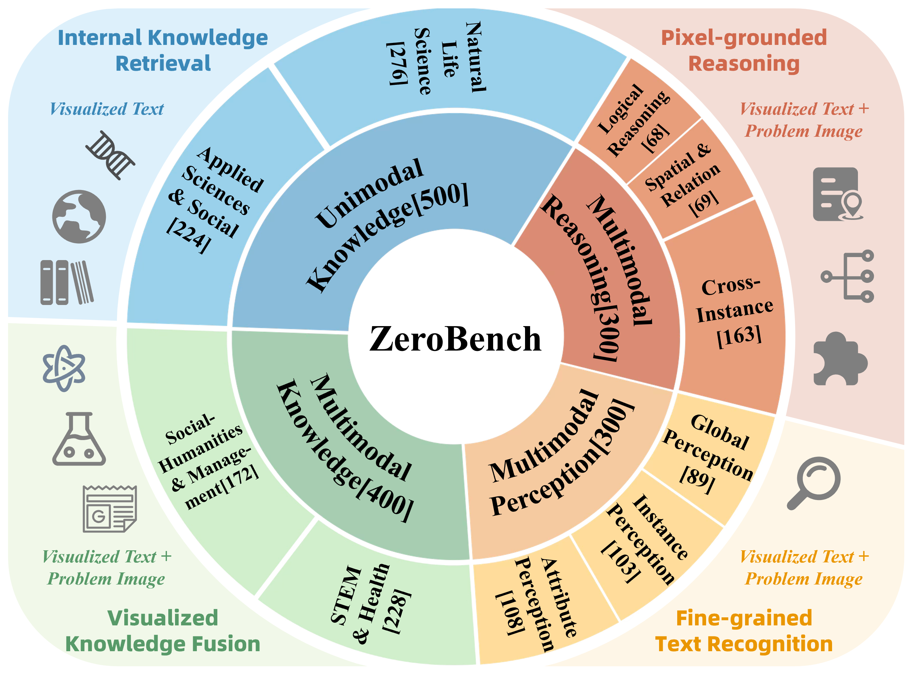
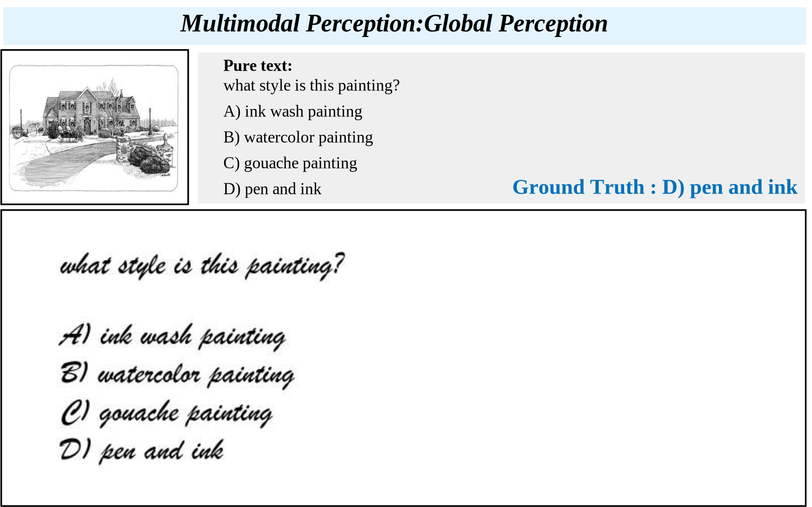

# VISTA-Bench

<p align="center">
  
</p>
<p align="center">
  <strong>Do VLMs really understand visualized text as well as pure text?</strong><br/>
  A systematic benchmark spanning <em>multimodal perception → reasoning → unimodal knowledge</em>.
</p>

<p align="center">
  
  
  
  
</p>

<p align="center">
  <em>Figure 1: Motivation of VISTA-Bench.</em>
</p>

---

## Overview

We introduce **VISTA-Bench**, a systematic benchmark spanning multimodal perception, reasoning, and unimodal understanding. It evaluates *visualized text understanding* by contrasting **pure-text** and **visualized-text (VT)** questions under controlled rendering conditions.

---

## Dataset at a glance

- **Size:** 1,500 instances
- **Composition:** predominantly multiple-choice questions (MCQ), with a small portion of open-ended queries
- **Task taxonomy (4 primary categories):**
  - **Unimodal Knowledge:** 500
  - **Multimodal Knowledge:** 400
  - **Multimodal Perception:** 300
  - **Multimodal Reasoning:** 300

<p align="center">
  
</p>
<p align="center">
  <em>Figure 2: Ability dimensions and task taxonomy of VISTA-Bench.</em>
</p>

---

## Qualitative example

<p align="center">
  
</p>
<p align="center">
  <em>Figure 3: A representative multimodal perception case under the visualized-text interface.</em>
</p>

---

## Repository structure

```text
VISTA-Bench/
├─ assets/figures/    # figures used in this README
├─ images/            # original images (for multimodal instances)
├─ questions/         # rendered question/option images (VT setting)
├─ VLMEvalKit/        # evaluation toolkit
├─ VISTA-Bench.tsv    # dataset index (currently identical to the VT variant)
└─ VISTA-Bench-VT.tsv # dataset index (currently identical; kept for compatibility)
```

> **Note:** `VISTA-Bench.tsv` and `VISTA-Bench-VT.tsv` are currently identical; we keep both filenames for compatibility and will refine the organization later.

---

## Data format

- `images/`: original images used by multimodal instances
- `questions/`: rendered question/option images for the visualized-text (VT) setting
- `*.tsv`: dataset metadata and file paths used for evaluation

---

## Evaluation (VLMEvalKit)

We evaluate VISTA-Bench with `VLMEvalKit/`.  
Before running evaluation, we recommend converting the TSV file(s) into a normalized format with absolute image paths.

### 1) Convert TSV to normalized paths

Helper script:
- `VISTA-Bench/VLMEvalKit/utils/convert_data_file.py`

What it does:
- converts the TSV encoding to UTF-8
- normalizes path separators (`\` → `/`)
- renames `options_A/B/C/D` → `A/B/C/D` when needed
- converts `image_path` and `question_image_path` into a bracket-style multi-path string

Example:

```bash
python VISTA-Bench/VLMEvalKit/utils/convert_data_file.py   --in   VISTA-Bench/VISTA-Bench.tsv   --out  VISTA-Bench/VISTA-Bench_norm.tsv   --image-prefix /ABS/PATH/TO/VISTA-Bench   --strip-token ""
```

### 2) Run evaluation

**Pure-text:**
```bash
python run.py \
  --data VISTA-Bench \
  --model llava_v1.5_7b \
  --verbose
```

**Visualized-text (VT):**
```bash
python run.py \
  --data VISTA-Bench-VT \
  --model llava_v1.5_7b \
  --verbose
```

---

## Citation

To be added.

---

## License

To be added.
